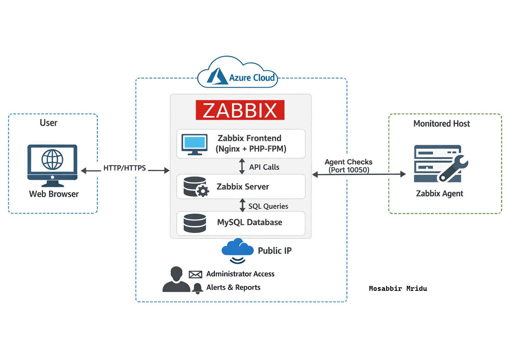
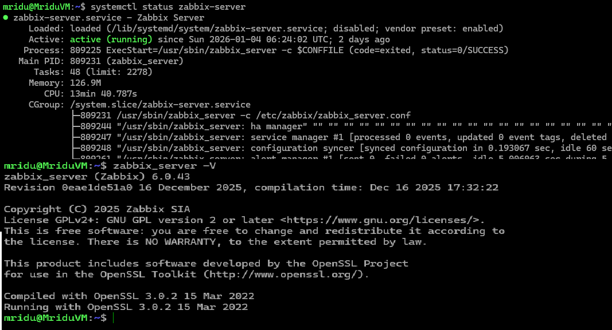
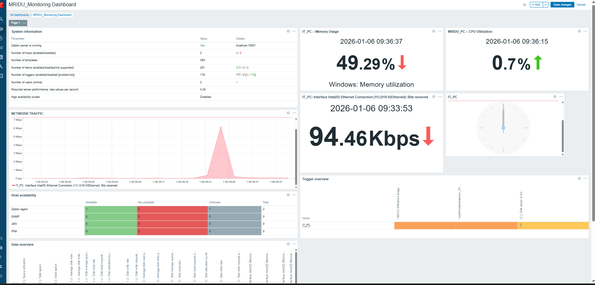
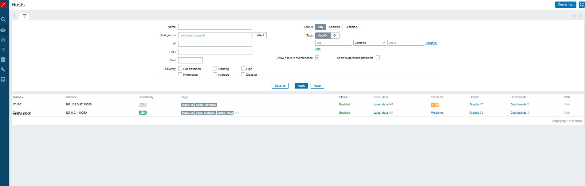

# Zabbix Monitoring Setup on Azure (Beginner Friendly)

# Complete Step-by-Step Guide

This repository provides a **complete, beginner-friendly guide** to deploying and configuring
**Zabbix Monitoring System on Microsoft Azure** using a Linux virtual machine.

Anyone can follow this guide to set up Zabbix from scratch and start monitoring servers.

---

## 📌 Project Overview

This project demonstrates:

- Deploying **Zabbix Server on Azure VM**
- Configuring **Zabbix Frontend (Nginx + PHP-FPM)**
- Setting up **Zabbix Agent**
- Monitoring hosts (CPU, Memory, Disk, Network)
- Viewing dashboards and collected metrics

---

## 🧱 Architecture Overview

<p align="center">
  
</p>

### Architecture Flow
- User accesses Zabbix Web UI via browser
- Zabbix Frontend communicates with Zabbix Server
- Zabbix Server stores data in MySQL database
- Zabbix Agent sends metrics from monitored hosts

---

## 🧰 Prerequisites

Before starting, ensure you have:

- Microsoft Azure account
- Ubuntu Linux VM (20.04 / 22.04 recommended)
- Public IP assigned to VM
- Open ports in Azure NSG:
  - 22 (SSH)
  - 80 (HTTP)
  - 10050 (Agent)
  - 10051 (Server)
- Basic Linux command knowledge

---

## 🛠️ Technologies Used

| Component | Technology |
|---------|-----------|
| Cloud | Microsoft Azure |
| OS | Ubuntu Server |
| Monitoring | Zabbix Server & Agent |
| Web Server | Nginx |
| Database | MySQL |
| Language | PHP |
| Version Control | GitHub |

---

## 📂 Project Structure

Zabbix-Setup-Azure/
│
├── screenshots/
│ ├── dashboard.png
│ ├── hosts.png
│ └── zabbix-overview.png
│
└── README.md


---

## ✅ Step 1: Prepare Azure Virtual Machine


1. Login to **Azure Portal**
2. Create a **Linux VM (Ubuntu)**
3. Assign **Public IP**
4. Allow inbound rules:
   - SSH (22)
   - HTTP (80)
   - TCP 10050, 10051

---

## ✅ Step 2: Update the System


```bash
sudo apt update && sudo apt upgrade -y
```


---


---

### ✅ Step 3: Install Zabbix Repository

```bash
wget https://repo.zabbix.com/zabbix/6.0/ubuntu/pool/main/z/zabbix-release/zabbix-release_6.0-4+ubuntu22.04_all.deb
sudo dpkg -i zabbix-release_6.0-4+ubuntu22.04_all.deb
sudo apt update


```

### ✅ Step 4: Install Zabbix Server, Agent & Frontend
```md

sudo apt install zabbix-server-mysql zabbix-frontend-php zabbix-agent -y

```

---

## ✅ Step 5: Install and Configure MySQL

```md

sudo apt install mysql-server -y
sudo mysql_secure_installation

```

#### Create Database and User
```md
```sql
CREATE DATABASE zabbix character set utf8mb4 collate utf8mb4_bin;
CREATE USER 'zabbix'@'localhost' IDENTIFIED BY 'StrongPassword';
GRANT ALL PRIVILEGES ON zabbix.* TO 'zabbix'@'localhost';
FLUSH PRIVILEGES;
EXIT;
```

## ✅ Step 6: Import Initial Zabbix Database Schema

```md
zcat /usr/share/doc/zabbix-server-mysql*/create.sql.gz | mysql -uzabbix -p zabbix

```

## ✅ Step 7: Configure Zabbix Server

```md
```bash
sudo nano /etc/zabbix/zabbix_server.conf

```

Update the database password:

DBPassword=StrongPassword
Save and exit.


---

## ✅ Step 8: Configure PHP for Zabbix

```md
```bash
sudo nano /etc/zabbix/nginx.conf

```

```md
```ini
php_value[date.timezone] = Asia/Dhaka

Set correct timezone:

php_value[date.timezone] = Asia/Dhaka


For common issues and fixes, see:
- documentation/troubleshooting.md

```

## ✅ Step 9: Start and Enable Services

```md
sudo systemctl restart zabbix-server zabbix-agent nginx mysql
sudo systemctl enable zabbix-server zabbix-agent nginx mysql


```

### Server Environment (Azure VM)



## ✅ Step 10: Access Zabbix Web Interface

Open browser:


http://<Azure-VM-Public-IP>/zabbix
Follow the web installer:

DB user: zabbix

DB password: StrongPassword

Finish setup

## 📸 Screenshots

### Zabbix Dashboard


---


## 🧪 Step 11: Add a Host for Monitoring

Login to Zabbix Web UI

1. Go to **Configuration → Hosts**
2. Click **Create host**
3. Add:
   - Hostname
   - IP Address
   - Template: *Linux by Zabbix Agent*
4. Click **Save**


### Host Monitoring


## 📘 Learning Outcomes

By completing this project, you will gain:

- Hands-on experience with **Azure Virtual Machine configuration**
- Practical understanding of **real-world monitoring implementation**
- Strong working knowledge of **Zabbix Server and Zabbix Agent**
- Experience with **database-backed monitoring systems**
- Skills in creating **production-style technical documentation**


## 🔮 Future Improvements

In future iterations, this project can be extended with:

- Alert notifications via Email and Telegram
- SNMP-based monitoring for routers and switches
- Grafana integration for advanced dashboards
- Scalable multi-host and multi-environment monitoring
  
📎 Additional Documentation

For environment details and troubleshooting, see:

documentation/azure-notes.md

documentation/troubleshooting.md


## 👤 Author

**Mosabbir Mridu**  
System & Network Engineer  

🔗 GitHub: https://github.com/mosabbir4210

